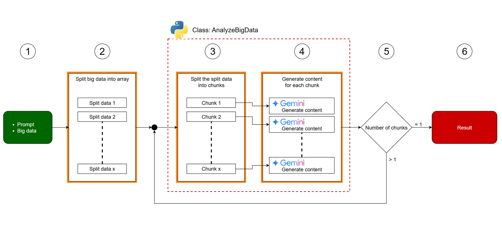

# analyze_big_data_by_Gemini

<a name="top"></a>
[](LICENCE)

<a name="overview"></a>


# Overview
Generative AI faces limits in processing massive datasets due to context windows. Current methods can't analyze entire data lakes. This report presents a Gemini API approach for comprehensive big data analysis beyond typical model limits.

# Description
Generative AI has advanced significantly but faces challenges processing truly massive datasets due to practical limits like context windows, often around a million tokens or less. This restricts the comprehensive analysis of large data lakes. While methods like RAG help with specific data retrieval, they are insufficient for synthesizing insights from billions or trillions of data points, requiring full scope analysis. This report introduces an approach utilizing the Gemini API specifically designed to address this challenge, demonstrating how to process and derive insights from big data exceeding typical model limitations.

# Workflow



The above workflow image is described as follows:

1.  **Prepare a prompt and big data.** The prompt is a text for comprehensively processing the big data.
2.  **Split the big data into an array.** For instance, if the data is a document like a story, it might be split by a period. The split data is then sent to an instance of the `AnalyzeBigData` class.
3.  **Inside the `AnalyzeBigData` class, the data is split into chunks.** Each chunk's token count is kept below the input token limitation of the Gemini API.
4.  **Generate content for each chunk using the given prompt.** This step utilizes Gemini to process each chunk.
5.  **If the number of chunks resulting from the processing is more than 1, the generated contents are processed by the `AnalyzeBigData` class again.** This indicates a recursive or iterative process.
6.  **If the number of chunks is 1, the final result is returned.** This is the termination condition for the process.

# Usage

## 1. Get API key

In order to use the scripts in this report, please use your API key. [Ref](https://ai.google.dev/gemini-api/docs/api-key) This API key is used to access the Gemini API.

## 2. Class AnalyzeBigData

This is a Python script. You can see the whole script in this repository.

[https://github.com/tanaikech/analyze_big_data_by_Gemini](https://github.com/tanaikech/analyze_big_data_by_Gemini)

This is the main class `AnalyzeBigData` for testing the following sample scripts.

- When you use this, please create a file `analyze_big_data_by_Gemini.py` that includes the following script.
- The following sample scripts use this script as `from analyze_big_data_by_Gemini import AnalyzeBigData`.

**Here, `data` as big data is required to be a list. Please be careful about this.**

## 3. Prepare data

### Pattern 1
As a pattern 1, when you test the script of the "Sample script" section, please prepare sample data. In this sample, `data` is a list of strings as follows.

```json
["text1", "text2",,,]
```

This sample script assumes that the big data is a list containing text data, and the data in the file is also a list containing text data.

You can see the sample script using this in section 4, "Sample script".

### Pattern 2
As a pattern 2, of course, you can use JSON data within the list. In that case, including the JSON schema in the prompt will help generate content.

Also, for the Class `AnalyzeBigData`, the response schema can also be set. This allows you, for example, to directly generate JSON data from the big data.

When the sample JSON schema and the sample response schema are used, the sample script is as follows. The sample data is as follows.

```json
[
    {"key1": "value1", "key2": 123},
    {"key1": "value2", "key2": 456},
    ,
    ,
    ,
]
```

```python
api_key = "###" # Please set your  API key.
data = [,,,] # Please set your data.

sample_json_schema = {
    "title": "Sample Data Schema",
    "description": "Sample description",
    "type": "array",
    "items": {
        "type": "object",
        "properties": {
            "key1": {"type": "string", "description": "Sample description"},
            "key2": {"type": "number", "description": "Sample description"},
        },
        "required": ["key1", "key2"],
    },
}
sample_response_schema = {
    "type": "object",
    "properties": {"content": {"type": "string", "description": "Generated content"}},
}
object = {
    "api_key": api_key,
    "data": data,
    "prompt": f"JSON schema of given data is as follows. <JSONSchema>${json.dumps(sample_json_schema)}</JSONSchema> Summarize the data.",
    "response_schema": sample_response_schema,
}
res = AnalyzeBigData().run(object)
```

In this case, the following result is obtained.

```json
{"content": "Generated content"}
```

The results using the actual data can be seen at my repository. [https://github.com/tanaikech/analyze_big_data_by_Gemini](https://github.com/tanaikech/analyze_big_data_by_Gemini)

## 4. Sample script

**In this sample, it is supposed that the big data is put into a file, and also the data in the file is a list including text data.**

Before you use this sample script, please set `api_key`, `filename`, `file_path`, and `prompt`, respectively.

```python
from analyze_big_data_by_Gemini import AnalyzeBigData
import json
import os


api_key = "###" # Please set your API key
filename = "###" # Please set your filename of file of the big data.
file_path = os.path.join("./", filename) # Please set your path of the file.

prompt = "Summarize data." # Please set your prompt

data = []
with open(file_path, "r", encoding="utf-8") as f:
    data = json.loads(f.read())

object = {
    "api_key": api_key,
    "data": data,
    "prompt": prompt,
}

l = 0
res = []
while len(res) != 1:
    l += 1
    print(f"\n\n### Loop: {l}")
    res = AnalyzeBigData().run(object)
    object["data"] = res
    print(f"Number of chunks: {len(res)}")

print(res[0])
with open(os.path.join("./", "Result_" + filename), "w", encoding="utf-8") as f:
    f.write(res[0])
```

## 5. Testing

When this script is run, you can see the following flow in the terminal. In this sample flow, 2 loops are run. At the 1st loop, the given data is split into 10 chunks. At the 2nd loop, 10 generated results from 10 chunks are split into 1 chunk. And that is returned as the final result.

```
### Loop: 1
AnalyzeBirgData... start
Length of tempData (from './temp.txt') is 0.
Data chunking... start
The input data (1000) was divided into 10 chunks.
Gemini API calls will be attempted for 10 new chunks (total 10).
Data chunking... end
Process chunk... start

### Processing chunk 1 / 10...
Upload chunk... start
Upload chunk... end
Total tokens: 500000
Generating content... start
Generating content... end
Generated content is not in JSON format.
Saved temporary data to './temp.txt'. Current length: 1.

.
.
.

### Processing chunk 10 / 10...
Upload chunk... start
Upload chunk... end
Total tokens: 100000
Generating content... start
Generating content... end
Generated content is not in JSON format.
Saved temporary data to './temp.txt'. Current length: 10.
Process chunk... end

All 5 chunks processed! Temporary file './temp.txt' is deleted.
AnalyzeBirgData... end
Number of chunks: 10


### Loop: 2
AnalyzeBirgData... start
Length of tempData (from './temp.txt') is 0.
Data chunking... start
The input data (10) was divided into 1 chunks.
Gemini API calls will be attempted for 1 new chunks (total 1).
Data chunking... end
Process chunk... start

### Processing chunk 1 / 1...
Upload chunk... start
Upload chunk... end
Total tokens: 100000
Generating content... start
Generating content... end
Generated content is not in JSON format.
Saved temporary data to './temp.txt'. Current length: 1.
Process chunk... end

All 1 chunks processed! Temporary file './temp.txt' is deleted.
AnalyzeBirgData... end
Number of chunks: 1
```

After the above steps, you can see the final result by `print(res[0])` in the sample script.

<a name="results"></a>

# Results
Here, it introduces the results generated using the actual data.

<a name="results"></a>

## 1. Analyzing Google Apps Script from Stackoverflow

This report can be seen at []().

# Note
- The top image was generated by Gemini.

---

<a name="licence"></a>

# Licence

[MIT](LICENCE)

<a name="author"></a>

# Author

[Tanaike](https://tanaikech.github.io/about/)

[Donate](https://tanaikech.github.io/donate/)

<a name="updatehistory"></a>

# Update History

- v1.0.0 (May 1, 2025)

  1. Initial release.

[TOP](#top)

